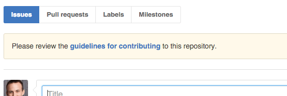

# Contributing

You **always** want to look at this file *before* contributing. In here you should find
steps that you need to take to set up your development environment as well as instructions
for coding standards and contributing guidelines.

You'll notice that when this file is present, GitHub will give you an alert when creating
a new issue, indicating that you should check out the guidelines first:

